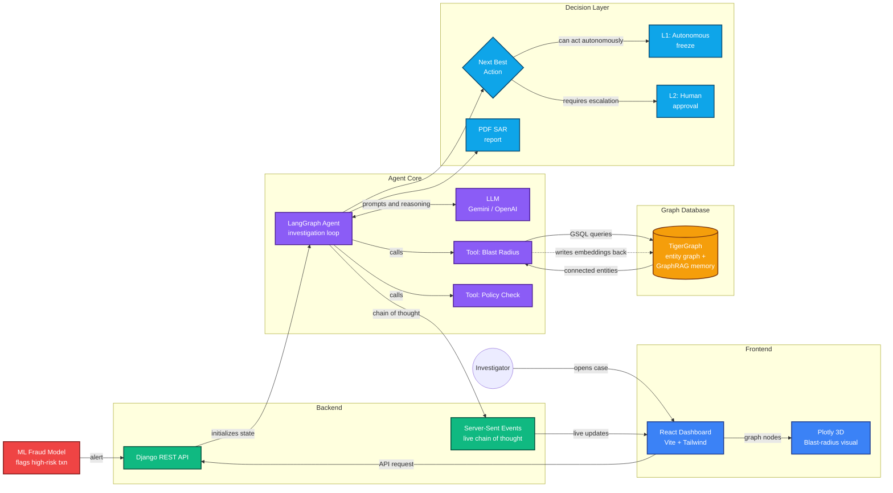

# 🔍 FraudLens AI — Autonomous GraphRAG Fraud Investigation Agent

[](https://youtu.be/cs-Tc8nTyoc)

**🎥 [Watch the Demo Video](https://youtu.be/cs-Tc8nTyoc)** · **📖 [Read the Technical Blog Post](https://dev.to/himanshurajnimse/fraudlens-ai-an-autonomous-graph-agent-that-investigates-financial-crime-4l16)**

---

An agentic fraud triage system that uses **TigerGraph GraphRAG** to map fraud rings, reason over real graph paths, and generate compliance-ready Suspicious Activity Reports (SARs).

Fraud rarely looks like fraud in a single row of data. It shows up in the connections — a shared IP address, a reused device, a chain of accounts that all trace back to one bad actor. Investigators still find those connections by hand. FraudLens AI automates the entire workflow.

---

## 🚀 What It Does

| Capability | Description |
|---|---|
| **Autonomous Investigation** | The AI agent receives a flagged transaction, traverses the TigerGraph knowledge graph, and builds a complete evidence chain — without human intervention. |
| **Blast Radius Mapping** | Calculates the total financial exposure by aggregating every account, device, and money flow reachable within N hops of the suspect entity. |
| **Real-Time Chain of Thought** | Streams the agent's reasoning to the dashboard via Server-Sent Events (SSE), so investigators can watch and audit every step live. |
| **L1/L2 Decision Routing** | Autonomously freezes accounts for clear-cut cases (L1). Escalates ambiguous cases for human approval (L2). |
| **SAR PDF Generation** | One-click export of a compliance-ready Suspicious Activity Report containing the case ID, evidence, and actions taken. |
| **Graph Memory** | After every investigation, the agent vectorizes the case and writes it back to TigerGraph, so future investigations have more context. |

---

## 🏗️ Architecture



---

## 🐯 How TigerGraph Is Used (GraphRAG)

Standard RAG retrieves text chunks by semantic similarity. Our agent retrieves **structure**.

We modeled customers, accounts, devices, IPs, and transactions as a native graph in TigerGraph. The agent runs **GSQL** queries to pull the connected subgraph around a flagged entity and calculates the blast radius — every account, device, and money flow reachable within N hops. That subgraph becomes the LLM's context window, grounding every claim the model makes in actual data paths.

TigerGraph also acts as **persistent memory**. When an investigation finishes, the agent embeds the case summary and writes it back to the graph. Every resolved case gives the next investigation more context to work with.

**GSQL queries used:**
- [`schema.gsql`](./graph/schema.gsql) — Graph schema (vertices and edges)
- [`load_data.gsql`](./graph/load_data.gsql) — Data loading job
- [`find_fraud_connections.gsql`](./graph/find_fraud_connections.gsql) — Multi-hop fraud ring traversal

---

## 🤖 Agent Tools

The LangGraph agent has 8 callable tools that it autonomously decides when to invoke:

| Tool | Purpose |
|---|---|
| `get_connected_entities` | Traverses TigerGraph to find all devices, accounts, and IPs linked to a transaction within N hops. |
| `calculate_blast_radius` | Aggregates total financial exposure across the connected entity cluster. |
| `search_case_memory` | Searches the vector database (GraphRAG) for similar historical fraud cases. |
| `check_fraud_policy` | Validates the recommended action against internal bank compliance rules. |
| `request_additional_evidence` | Requests step-up authentication or additional KYC data when confidence is low. |
| `create_and_update_case` | Creates or updates the internal investigation case record with findings. |
| `execute_resolution_action` | Executes the final action (account freeze, block, or escalation). |
| `update_case_memory` | Vectorizes the completed case and writes embeddings back to TigerGraph. |

---

## 🛠 Tech Stack

| Layer | Technology |
|---|---|
| **Frontend** | React, TailwindCSS, Vite, Plotly.js, Lucide Icons, jsPDF, html2canvas |
| **Backend** | Django, Django REST Framework, Server-Sent Events (SSE) |
| **Agent** | LangGraph, LangChain, Gemini / OpenAI LLM |
| **Graph Database** | TigerGraph (GSQL), pyTigerGraph |
| **Vector Store** | FAISS (via LangChain Community) |
| **Embeddings** | HuggingFace Sentence Transformers |

---

## 🏁 Hackathon Rubric Alignment

| Requirement | How We Satisfy It |
|---|---|
| **Working agent** | LangGraph agent with 8 tools, autonomous investigation loop, real-time SSE streaming. |
| **Answer file per case** | 20 strictly formatted JSON reports in [`cases/`](./cases/). |
| **Case written to graph** | `update_case_memory` tool vectorizes and writes embeddings back to TigerGraph after every case. |
| **SAR when required** | One-click PDF export containing case ID, evidence chain, and actions taken. |
| **Next best action before evidence** | Agent recommends L1 (freeze) or L2 (escalate) immediately upon graph traversal. |
| **Next best action after evidence** | After `request_additional_evidence` returns, the agent re-evaluates and updates its recommendation. |
| **Demo video** | [Watch on YouTube](https://youtu.be/cs-Tc8nTyoc) |
| **Technical blog post** | [Read on Dev.to](https://dev.to/himanshurajnimse/fraudlens-ai-an-autonomous-graph-agent-that-investigates-financial-crime-4l16) |

---

## 📂 Project Structure

```
tigergraph-fraud-agent/
├── backend/
│   ├── agent/
│   │   ├── graph.py              # LangGraph agent definition
│   │   ├── tools.py              # 8 agent tools (blast radius, policy, etc.)
│   │   ├── tigergraph_client.py  # pyTigerGraph connection & GSQL queries
│   │   └── memory_rag.py         # FAISS vector store for case memory
│   ├── api/
│   │   ├── views.py              # SSE streaming endpoint
│   │   └── urls.py               # API routes
│   ├── generate_submissions.py   # Batch script for 20 benchmark cases
│   └── submission_outputs/       # 20 generated evaluation reports
├── frontend/
│   └── src/
│       └── App.jsx               # Full React dashboard
├── graph/
│   ├── schema.gsql               # TigerGraph schema
│   ├── load_data.gsql            # Data loading job
│   └── find_fraud_connections.gsql  # Multi-hop traversal query
└── dataset/
    ├── transactions.csv
    ├── identity.csv
    └── case_pack.csv
```

---

## ⚙️ How to Run Locally

### 1. Start the Backend (Django)
```bash
cd backend
python -m venv .venv

# Activate virtual environment:
# Windows: .\.venv\Scripts\Activate.ps1
# Mac/Linux: source .venv/bin/activate

pip install -r requirements.txt
python manage.py runserver
```

### 2. Start the Frontend (React/Vite)
```bash
cd frontend
npm install
npm run dev
```

### 3. Open the App
Navigate to `http://localhost:5173` in your browser.

### 4. Generate the 20 Submission Files
```bash
cd backend
python generate_submissions.py
```
Output will be saved to `cases/`.

---

## 🔗 Links

- **GitHub:** [github.com/HimanshurajNimse/TigerGraph-Fruad](https://github.com/HimanshurajNimse/TigerGraph-Fruad)
- **Demo Video:** [youtu.be/cs-Tc8nTyoc](https://youtu.be/cs-Tc8nTyoc)
- **Blog Post:** [dev.to/himanshurajnimse/fraudlens-ai](https://dev.to/himanshurajnimse/fraudlens-ai-an-autonomous-graph-agent-that-investigates-financial-crime-4l16)

*Built for the TigerGraph Hackathon.*
